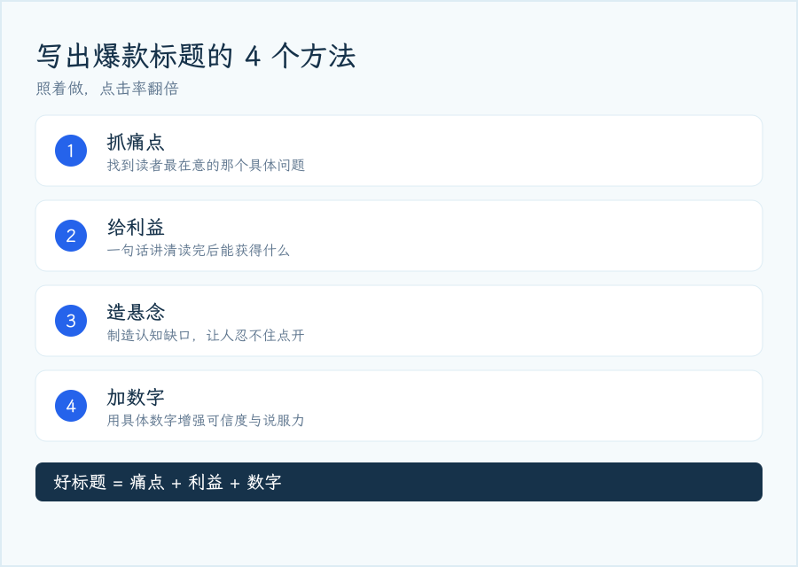
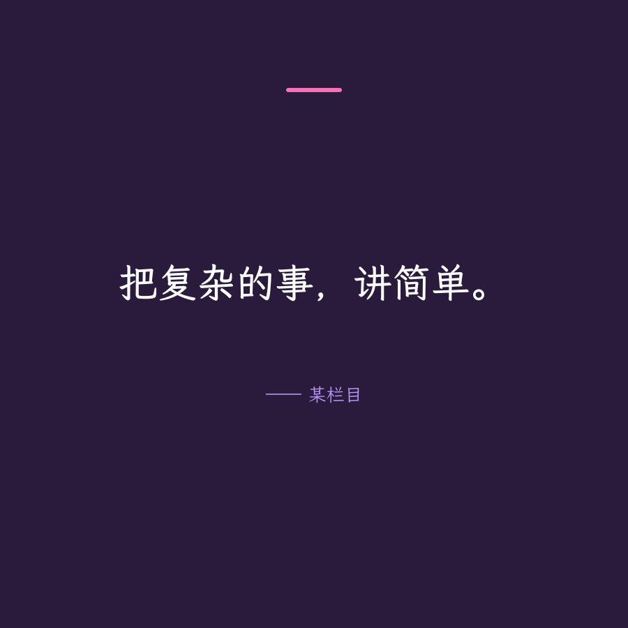

# svg-illustration-skill

用 SVG 设计**信息图 / 配图 / 封面 / 金句卡**并导出 PNG 的 Agent 技能包 —— 面向 AI 的一整套「**一次画对，不返工**」工具链。

## 这是什么

一个可复用的 Agent Skill（技能），指导并辅助 AI 完成 SVG 静态配图的完整流程：

```
选配色卡 → 填文案 → 排版 → 静态校验 → 渲染 → 程序化验证 → 嵌入
```

所有规则都来自**实测**（rsvg-convert 渲染 + 像素级验证），专门解决 AI 画 SVG 时最高频的坑：

| 坑 | 症状 | 本项目的解法 |
|---|---|---|
| 中文字体缺失 | 中文全变豆腐块 □□□ | `fc-match` 验字体 + 字体回退链 |
| SVG 里放 emoji | 渲染成实心方块 | emoji 静态检测 + 矢量替代 |
| 文字不换行/不测量 | 溢出、压到别的元素 | CJK 感知宽度估算 + 自动换行 |
| 背景框框不住文字 | 胶囊/卡片溢出 | 静态校验 + 框宽公式 |
| 对比度不足 | 小字看不清 | WCAG 对比度校验 |
| 封面被裁剪 | 分享后关键内容被切 | 公众号封面安全区规则 |

## 特性

- **中文排版**：`east_asian_width` 驱动的宽度估算，中文按字断行、英文按词断行，保留中英空格
- **写前验算**：SVG 静态检查（溢出 / 重叠 / emoji / 字体 / 对比度），先算后画，杜绝返工
- **程序化验证**：ASCII 预览 + 像素级包围盒 / 颜色定位 —— AI 无法直接看图时的「眼睛」
- **专业配色卡**：8 套对比度校验过的配色卡 + 系列配色 + 配色卡图生成
- **一键生成**：套配色卡 + 自动排版 + 指定尺寸/比例 + 校验 + 渲染，一条命令
- **内置模板**：公众号封面 / 正文信息图，含安全区提示

## 效果演示

以下三张图均由 `scripts/gen.py` 一键生成（文案 → 套配色卡 → 自动排版 → 校验 → 渲染）：

<p align="center">
  <br>
  <em>公众号封面 · 深海蓝配色（900×383，2.35:1）</em>
</p>

<p align="center">
  <br>
  <em>正文信息图 · 墨玉青配色（900×520）</em>
</p>

<p align="center">
  <br>
  <em>金句卡 · 绛紫霞配色（900×900）</em>
</p>

## 快速开始

### 依赖

- Python 3.8+
- [Pillow](https://python-pillow.org/)（`pip install Pillow`）
- [rsvg-convert](https://gitlab.gnome.org/GNOME/librsvg)（librsvg，SVG→PNG）
- 一款中文字体（用 `fc-match` 验证真实存在）

### 一键生成一张图

```bash
# 环境检查（字体必须验证真实存在，否则中文变豆腐块）
which rsvg-convert && fc-match "LXGW WenKai"

# 生成公众号封面（默认 900×383，2.35:1）
python3 scripts/gen.py cover \
  --palette 深海蓝 \
  --title "AI 编程工具横评：谁更强" \
  --subtitle "Claude Code / Codex / Cursor 实测" \
  --badge "深度分析" \
  --conclusion "谁更值得用？一图看懂" \
  --font "LXGW WenKai" --check --render

# 指定比例 / 尺寸
python3 scripts/gen.py cover --palette 晨雾蓝灰 --title "活动预告" --aspect 16:9 --width 1200
python3 scripts/gen.py quote --palette 曜石黑金 --text "把复杂的事讲简单" --aspect 3:4 --width 900
```

### 手动流程（完全可控）

```bash
python3 scripts/palette.py list                    # 1. 选配色卡
python3 scripts/textwidth.py "标题" --size 40      # 2. 估算文字宽度
#     写 design.svg（可基于 templates/ 改）
python3 scripts/check.py design.svg --margin 40    # 3. 静态校验（exit 0 再继续）
rsvg-convert -w 1200 design.svg -o design.png      # 4. 渲染（2x 高清）
python3 scripts/preview.py design.png              # 5. ASCII 目检布局
python3 scripts/verify.py design.png --boxes --mode bright --svg-width 900
```

## 目录结构

```
svg-illustration-skill/
├── SKILL.md                        # 技能指令（完整工作流 + 实测坑速查）
├── scripts/
│   ├── svgtext.py                  # 共享：CJK 宽度估算 + emoji 检测
│   ├── textwidth.py                # 文字宽度估算（CLI）
│   ├── layout.py                   # 换行 / 居中 / 网格定位（wrap/center/grid）
│   ├── check.py                    # SVG 静态检查（溢出/重叠/emoji/字体/对比度）
│   ├── palette.py                  # 专业配色卡库 + 系列配色（list/show/check/card）
│   ├── gen.py                      # 一键生成（cover/infographic/quote，支持任意比例）
│   ├── contrast.py                 # WCAG 对比度计算
│   ├── preview.py                  # PNG → ASCII 可视化
│   └── verify.py                   # 像素级范围/包围盒/颜色定位
└── templates/
    ├── cover-template.svg          # 公众号封面模板（含安全区提示）
    └── infographic-template.svg    # 正文信息图模板
```

## 脚本清单

| 脚本 | 作用 | 阶段 |
|---|---|---|
| `textwidth.py` | 估算文字渲染宽度（CJK 感知） | 写之前 |
| `layout.py` | 换行 / 居中 / 网格定位 | 写之前 |
| `check.py` | SVG 静态检查 | 写之前 |
| `palette.py` | 配色卡库 + 系列配色 | 选色 |
| `contrast.py` | WCAG 对比度 | 选色 |
| `gen.py` | 一键生成 | 写之前 |
| `preview.py` | ASCII 预览 | 渲染后 |
| `verify.py` | 像素级检测 | 渲染后 |

## 内置配色卡

30 套经过对比度校验的专业配色卡（`python3 scripts/palette.py list`）：

| 配色卡 | 定位 | 深底 / 主强调 / 点缀 |
|---|---|---|
| 深海蓝 | 科技 / AI / 专业 | `#16223a` / `#1A6FC4` / `#7C6FE8` |
| 墨玉青 | 国风 / 文化 / 中式 | `#14352F` / `#2A9D8F` / `#E9C46A` |
| 绛紫霞 | 文艺 / 女性 / 情感 | `#2A1B3D` / `#7C3AED` / `#F472B6` |
| 晨雾蓝灰 | 商务 / 企业 / 数据 | `#1E293B` / `#3B82F6` / `#38BDF8` |
| 暖阳橙 | 生活 / 美食 / 活力 | `#2B1F16` / `#F59E0B` / `#FB7185` |
| 松石蓝绿 | 清新 / 教育 / 医疗 | `#12333B` / `#0EA5E9` / `#2DD4BF` |
| 静谧绿 | 环保 / 健康 / 自然 | `#14271E` / `#22C55E` / `#A3E635` |
| 曜石黑金 | 高端 / 发布会 / 奢华 | `#161616` / `#D4AF37` / `#9CA3AF` |
| 珊瑚粉 | 女性 / 母婴 / 婚恋 | `#33101F` / `#F43F5E` / `#FB7185` |
| 电光紫 | 科技 / AI / 未来 | `#170A2E` / `#8B5CF6` / `#22D3EE` |
| 极简黑白 | 极简 / 杂志 / 高端 | `#111111` / `#52525B` / `#A1A1AA` |
| 国潮红 | 节日 / 促销 / 国潮 | `#6B1414` / `#DC2626` / `#FBBF24` |
| 莫兰迪 | 文艺 / 柔和 / 治愈 | `#3E3A36` / `#9C8A74` / `#8E8AA0` |
| 薄荷绿 | 健康 / 医疗 / 清新 | `#0E2A22` / `#10B981` / `#34D399` |
| 咖啡棕 | 咖啡 / 复古 / 商务 | `#2B1D15` / `#C2703D` / `#A1622B` |
| 香槟金 | 婚庆 / 高端 / 轻奢 | `#4A3823` / `#C9A227` / `#B8912B` |
| 马卡龙 | 甜点 / 可爱 / 儿童 | `#3D2B3A` / `#F472B6` / `#A78BFA` |
| 复古橄榄 | 复古 / 军工 / 户外 | `#2A2A1A` / `#B9A61A` / `#6B8E23` |
| 春日樱 | 春日 / 少女 / 浪漫 | `#3A1A2E` / `#EC4899` / `#F472B6` |
| 夏日海 | 夏日 / 海洋 / 清凉 | `#0A3D4B` / `#06B6D4` / `#0EA5E9` |
| 秋日枫 | 秋日 / 丰收 / 温暖 | `#3B2013` / `#EA580C` / `#C2410C` |
| 冬日雪 | 冬日 / 冰雪 / 纯净 | `#0F2E45` / `#38BDF8` / `#7DD3FC` |
| 圣诞 | 圣诞 / 节日 / 温暖 | `#0E2E1F` / `#16A34A` / `#DC2626` |
| 万圣节 | 万圣 / 鬼怪 / 派对 | `#1A0B14` / `#F97316` / `#A855F7` |
| 春节 | 春节 / 新年 / 喜庆 | `#991B1B` / `#DC2626` / `#FACC15` |
| 靛蓝 | 金融 / 法律 / 权威 | `#1E1B4B` / `#4F46E5` / `#6366F1` |
| 天空蓝 | 亲子 / 教育 / 医疗 | `#0C4A6E` / `#0284C7` / `#38BDF8` |
| 酒红 | 红酒 / 复古 / 奢华 | `#3D0F1E` / `#9F1239` / `#C0A062` |
| 鼠尾草 | 极简 / 家居 / 北欧 | `#2F3A30` / `#7C8B6F` / `#9CAF88` |
| 霓虹赛博 | 赛博朋克 / 游戏 / 电音 | `#0D0A14` / `#D946EF` / `#22D3EE` |

## 常用画布尺寸

`python3 scripts/gen.py sizes`：

| 用途 | 尺寸 | 比例 |
|---|---|---|
| 公众号封面 | 900×383 | 2.35:1 |
| 正文信息图 | 900×540 | 5:3 |
| 正方形金句卡 | 900×900 | 1:1 |
| 小红书配图 | 900×1200 | 3:4 |
| 社交分享 / OG 图 | 1200×630 | 1.91:1 |
| 横版 Banner | 1200×675 | 16:9 |
| 竖版海报 | 900×1600 | 9:16 |

## 字体版权

本仓库**只写字体名、不打包任何字体文件**；渲染在你本机用已安装的字体完成，输出是 PNG 位图，因此不涉及字体再分发或嵌入问题。

- **推荐使用 OFL 免费商用字体**（可商用、可嵌入、可再分发）：思源黑体（Source Han Sans / Noto Sans CJK SC）、思源宋体（Source Han Serif / Noto Serif SC）、霞鹜文楷（LXGW WenKai）、得意黑（[Smiley Sans](https://github.com/atelier-anchor/smiley-sans)，斜体窄黑，适合标题/展示）
- **系统专有字体**（PingFang SC 苹方、Hiragino、微软雅黑）**能显示 ≠ 能免费商用**：公众号封面 / 商品图等商用场景渲染它们存在侵权风险（微软雅黑版权在方正），且**不要提交其 .ttf/.ttc 文件到仓库再分发**。商用请一律用上一条的 OFL 字体。

本项目 README 中的演示图均使用霞鹜文楷（OFL 1.1）渲染。

## License

[MIT](./LICENSE)
